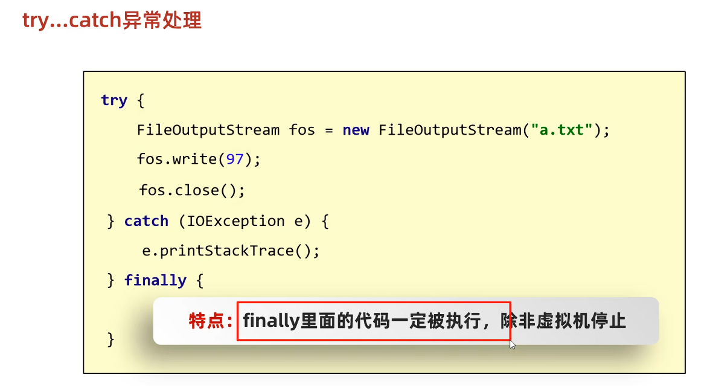
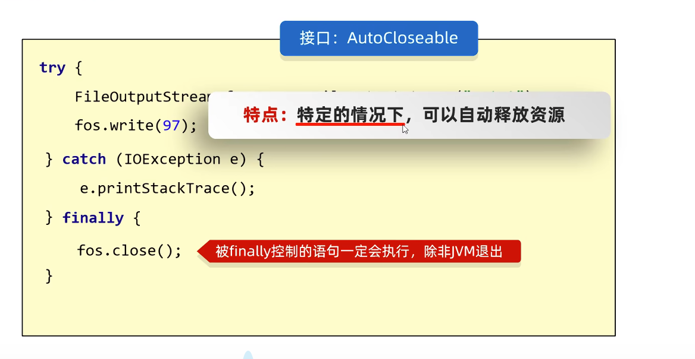
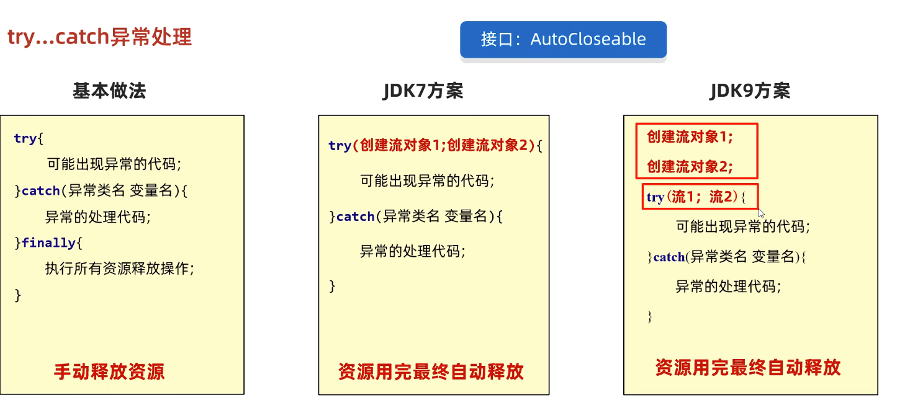

---

share: "true"
date modified: 2025年-12月-01日 19:19
created: 2025年-11月-05日 13:28
---




```Java
byte[] bytes = new byte[1024 * 1024 * 5];
FileInputStream fis = new FileInputStream("F:\\download\\第57次取消发送 - 菲菲公主.mp3");
FileOutputStream fos = new FileOutputStream("src\\javaStudy\\MyIO\\b.mp3");
try (fis; fos) {
    int b;
    while ((b = fis.read(bytes)) != -1) {
        fos.write(bytes, 0, b);
    }
} catch (IOException e) {
    e.printStackTrace();
}
```
