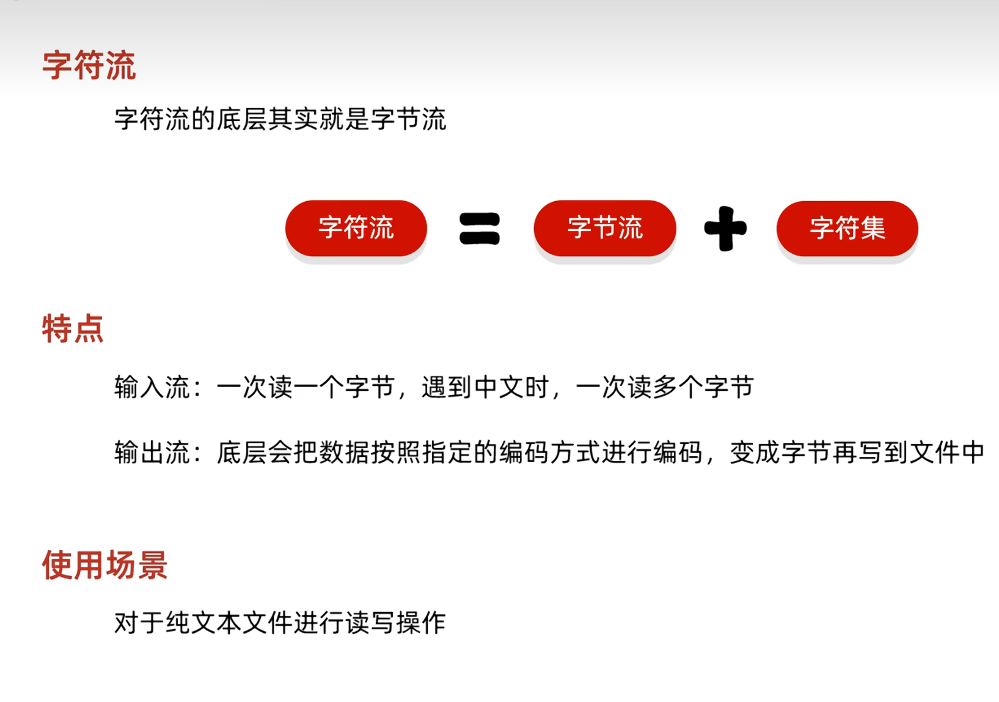
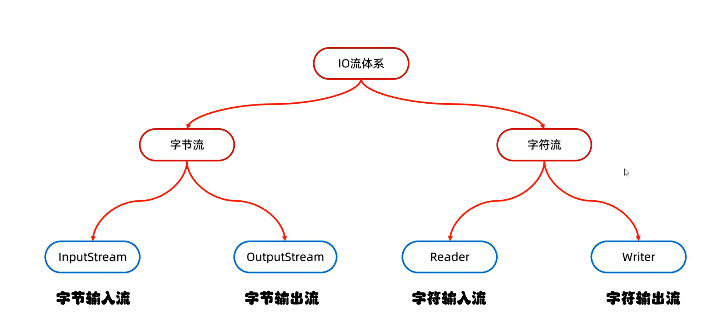
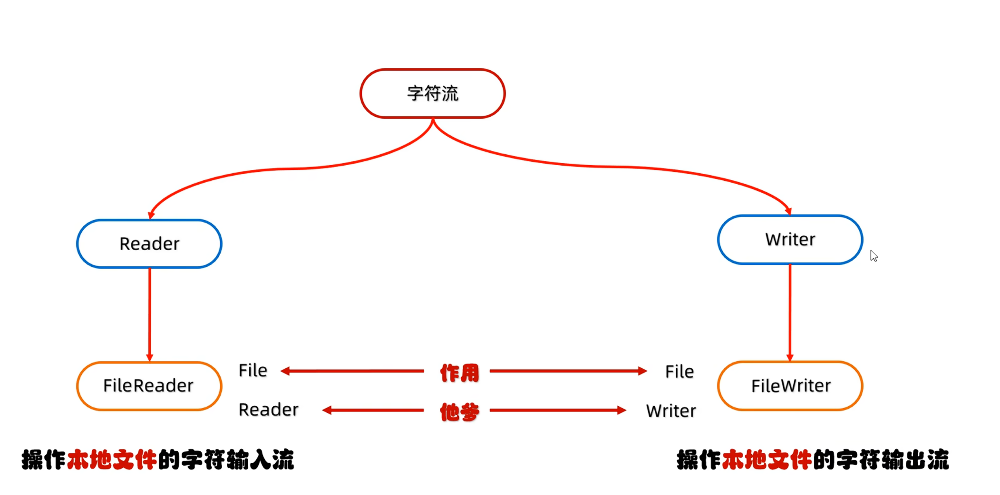
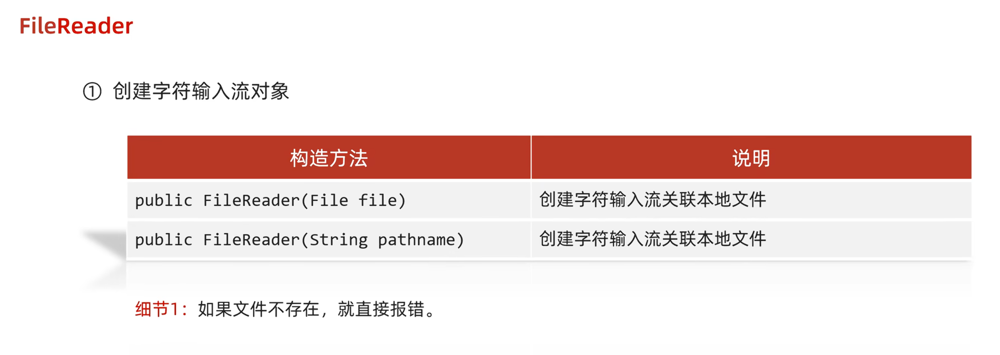
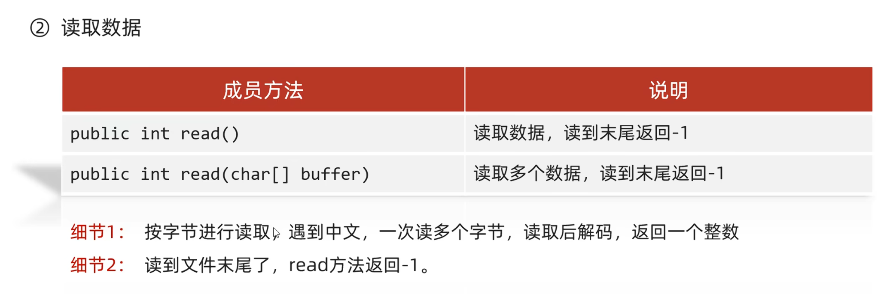
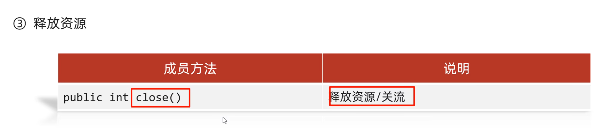

## 字符输入流




<!-- prettier-ignore -->
> [!NOTE] read细节
> 	 1.read():默认也是一个字节一个字节的读取的,如果遇到中文就会一次读取多个
> 	  2.在读取之后，方法的底层还会进行解码并转成十进制。
> 	  	最终把这个十进制作为返回值
> 	  	这个十进制的数据也表示在字符集上的数字
> 	  英文:文件里面二进制数据 0110 0001
> 	  	read方法进行读取，解码并转成十进制97
> 	  中文:文件里面的二进制数据 11100110 10110001 10001001
> 	  	read方法进行读取，解码并转成十进制27721
> 	  想看到中文数据只需要将这些数据进行强转就可以了
>

```Java
FileReader fr = new FileReader("src\\javaStudy\\MyIO\\a.txt");
int ch;
while ((ch = fr.read()) != -1) {
    System.out.print((char)ch);
}
fr.close();
```

```Java
FileReader fr = new FileReader("src\\javaStudy\\MyIO\\a.txt");
char[] chars = new char[2];
int ch;
while ((ch = fr.read(chars)) != -1){
    System.out.println(new String(chars,0,ch));
}
fr.close();
```

<!-- prettier-ignore -->
> [!NOTE] 有参的read方法
> 	将读取数据，解码和强转三步合并为一步，把强转后的字符放到数组中
> 	=空参的read方法 + 强制类型转换


