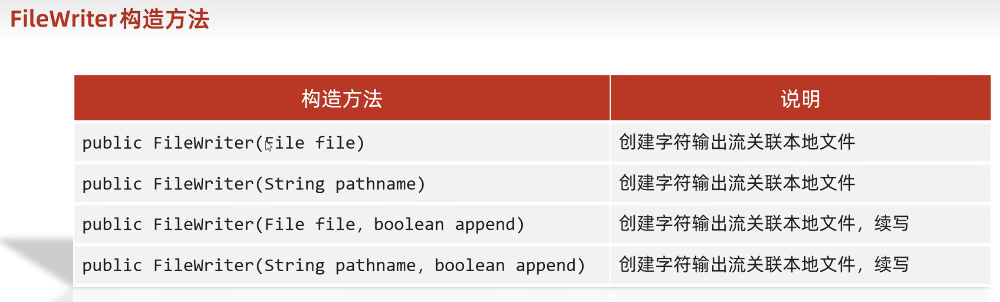
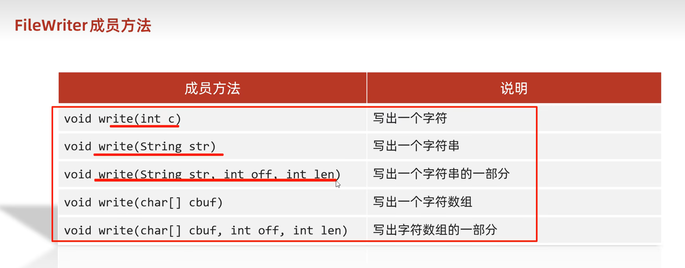
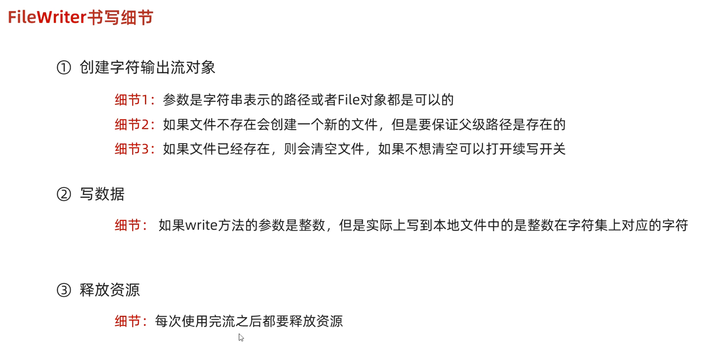

---

share: "true"
date modified: 2025年-12月-01日 19:19
created: 2025年-11月-06日 11:52
---




```Java
//一个字节
FileWriter fw = new FileWriter("src\\javaStudy\\MyIO\\a.txt");
fw.write(25105);
fw.close();

//一个字符串
FileWriter fw = new FileWriter("src\\javaStudy\\MyIO\\a.txt");
fw.write("hello");
fw.close();
```

## flush和close

