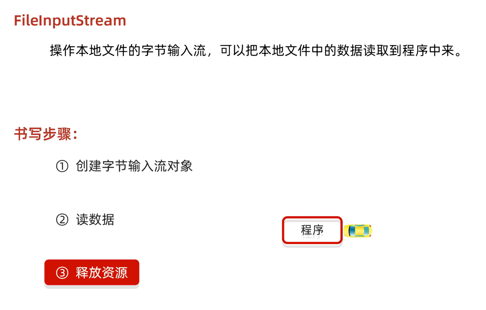
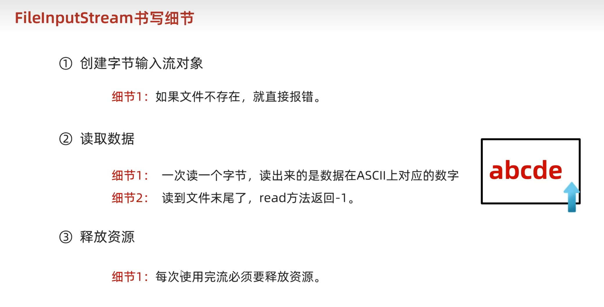
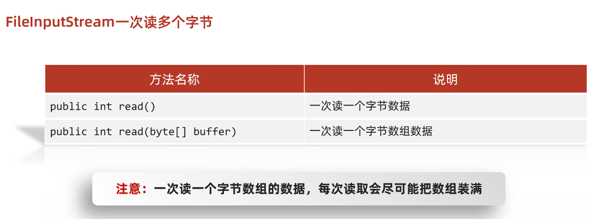

```Java
FileInputStream fis = new FileInputStream("src\\javaStudy\\MyIO\\a.txt");
int read = fis.read();
while (read != -1) {
    System.out.print((char) read);
    read = fis.read();
}
fis.close();
```



## FileInputStream一次读取多个字节



```Java
byte[] bytes = new byte[1024 * 1024 * 5];
FileInputStream fis = new FileInputStream("F:\\download\\第57次取消发送 - 菲菲公主.mp3");
FileOutputStream fos = new FileOutputStream("src\\javaStudy\\MyIO\\b.mp3");
int b;
long start = System.currentTimeMillis();
//b 表示个数
while ((b = fis.read(bytes)) != -1) {
    fos.write(bytes, 0, b);
}
long end = System.currentTimeMillis();
fos.close();
fis.close();
System.out.println("复制时间：" + (end - start) + "ms");
```
