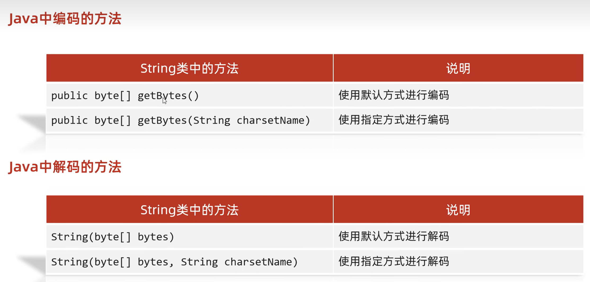

```Java
String str = "ai你哟";
//编码
byte[] bytes = str.getBytes();
System.out.println(Arrays.toString(bytes));

byte[] bytes1 = str.getBytes("GBK");
System.out.println(Arrays.toString(bytes1));

//解码
String str1 = new String(bytes);
System.out.println(str1);
//解码和编码格式不同会导致乱码
String str2 = new String(bytes, "GBK");
System.out.println(str2);
```
