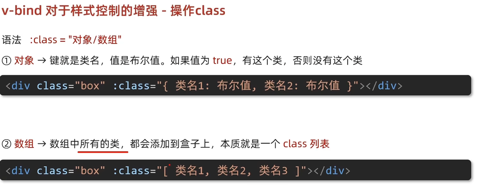
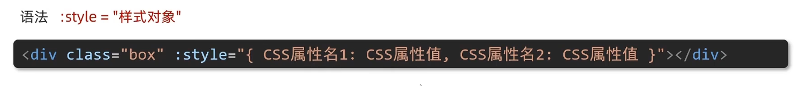

 

```html
<div id="app">
    <p></p>
    <button @click="changeImg">切换图片</button>  
</div>
<script>
    const app = new Vue({
        el: '#app',

        data: {
            imgUrl: '../../img/113493359_p0.webp',
        },

        methods: {
            changeImg() {
                this.imgUrl = '../../img/116990705_p0.webp'
            },
        },
    })
</script>
```

## v-bind: 可以简写为 :

## v-bind操作class




<!-- prettier-ignore -->
```html
<div class="box" :class="{container:true}">   
    <h1>记事本</h1>
</div>
<div class="box" :class="['container']">      
    <h1>记事本</h1>
</div>
```

## 操作Style



```html
<div id="app">
       
    <div :style="{width:'400px',height:'400px'}"></div>
     
</div>
```
