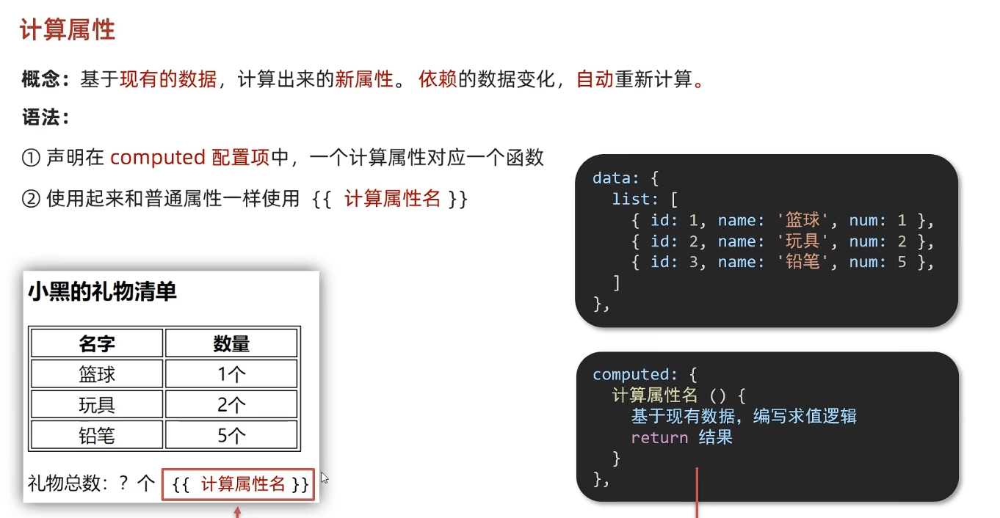

<!-- prettier-ignore -->
```html
<p>总数量：{{totalCount}}</p>
<script>
    computed:{
          totalCount(){
            let total = 0;
            this.tableList.forEach(element => {
              total += element.count;
            });
            return total;
          }
        }
</script>
```
